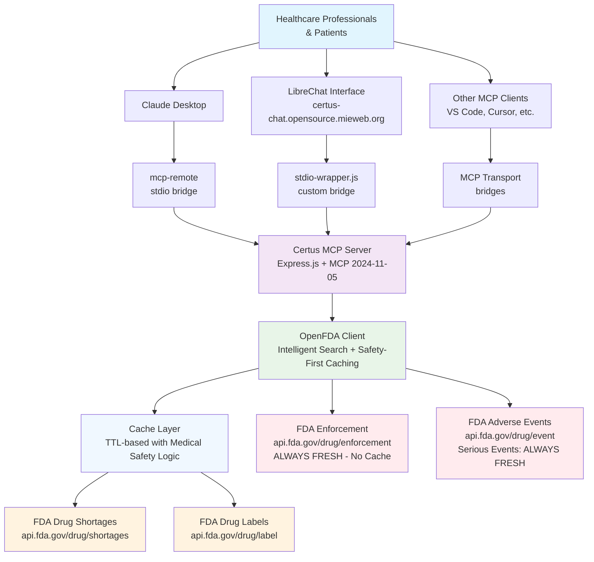

# Certus Drug Information MCP Server

**Get current FDA drug data in your AI assistant.**

Certus connects Claude, ChatGPT, and other AI assistants to official FDA databases. Your AI gets fresh information about drug shortages, recalls, and prescribing details instead of outdated training data.

This server gives you real-time access to FDA drug information including shortages, recalls, labels, and trend analysis.

## Try the Live Chatbot

**Test the Certus system immediately:** <https://certus-chat.opensource.mieweb.org>

Access real-time FDA drug information through a ChatGPT-like interface. No
setup required - just visit the link and start asking about drug shortages,
recalls, and medication information.

### See It in Action

[](https://www.youtube.com/shorts/lcSHZZthhp0)

*Click to watch: Real-time FDA drug information queries in the LibreChat interface*

> **Note:** If your search does not return results right away, try asking the chatbot to check the identifier type again. This is a known limitation of the current chatbot implementation, not a server issue.

## Key Features for Healthcare Professionals

**For clinical workflows, EHR integration, and regulatory compliance guidance, see our [Healthcare Professional Guide](docs/healthcare-guide.md).**

### Real-Time Drug Shortage Information

- Search the FDA drug shortage database by generic or brand name
- Handles name variations and misspellings automatically
- Gets raw FDA data without extra processing
- Shows shortage reasons, resolution estimates, and product details

### FDA Drug Label Data

- Complete FDA-approved prescribing information
- Generic and brand name cross-referencing
- Dosage forms, strengths, routes of administration, and manufacturer details
- Active ingredients, indications, contraindications, warnings, and adverse reactions

### Drug Recall and Safety Information

- Search the FDA enforcement database for drug recalls
- Recall classification (Class I, II, III), reason for recall, and affected lots
- Product descriptions, distribution information, and recall dates
- Raw FDA enforcement data

### Historical Data Analysis

- Analyzes drug shortage patterns from historical FDA records
- Set time periods for trend analysis (1-60 months)
- Shows shortage frequency, duration, and patterns
- Real-time trend analysis from FDA historical data

### Batch Processing

- Analyze up to 25 medications at once
- Get shortage, recall, and trend data for each drug
- Check entire formularies with one request
- Results organized by drug with error handling

### Clinical Information Integration

- Combined medication profiles with FDA label and shortage data
- Searches multiple FDA identifier types (generic name, brand name, openFDA fields)
- Cross-referenced data from FDA drug label and shortage databases
- Access to comprehensive FDA medication information

### FDA Adverse Event Reporting (FAERS)

- Search the FDA adverse event database for reported side effects and reactions
- Filter for serious adverse events only (hospitalization, death, disability, life-threatening conditions)
- Raw FAERS data with patient demographics, reaction terms, and safety report details
- General adverse events and serious events filtering with medical disclaimers

> **Note:** Adverse event searches can return large datasets. Search individual drugs rather than comparing multiple drugs at once to avoid hitting limits.

## How to Use the Chatbot

Visit <https://certus-chat.opensource.mieweb.org> and ask questions like:

**Drug Shortage Queries:**

- "Check current shortage status for insulin"
- "Search for metformin shortages"
- "Show shortage information for lisinopril"
- "Find shortage data for acetaminophen"

**Medication Label Information:**

- "Get FDA label information for metformin"
- "Show prescribing information for atorvastatin"
- "What are the approved uses for hydrochlorothiazide"
- "Get dosage forms available for ibuprofen"

**Drug Recall Searches:**

- "Search for recalls involving insulin products"
- "Check for any metformin recalls"
- "Find recent recalls for blood pressure medications"
- "Search recall database for acetaminophen"

**Complete Medication Profiles:**

- "Get complete medication profile for lisinopril"
- "Show combined label and shortage data for insulin"
- "Comprehensive information for metformin"

**Trend Analysis:**

- "Analyze shortage patterns for insulin over 12 months"
- "Show shortage trends for metformin in the past 6 months"
- "Historical shortage data for aspirin"

**Batch Analysis:**

- "Analyze these drugs for shortages: insulin, metformin, lisinopril"
- "Check shortage status for multiple diabetes medications"
- "Batch analysis of cardiovascular drugs with trend data"

**Adverse Events Queries:**

- "What adverse events have been reported for aspirin?"
- "Show me serious adverse events for warfarin"
- "Search for side effects of metformin in the FDA database"
- "Has the FDA received reports of serious reactions to atorvastatin?"

## Integration Options for Healthcare Systems

### Web-Based Chatbot Interface

Use the live chatbot at <https://certus-chat.opensource.mieweb.org> for immediate drug information queries. No setup needed.

### Claude Desktop Integration

Add Certus tools directly to Claude Desktop. Works with your existing AI assistant workflow.

### Custom MCP Client Development

Deploy the Certus server with any MCP-compatible client:

- LibreChat for custom healthcare chatbots
- VS Code with MCP extensions for development environments
- Custom applications using MCP client libraries
- Third-party MCP tools and platforms

### Direct API Integration

Use REST API endpoints for custom healthcare applications:

- HTTP POST to `/mcp` endpoint for JSON-RPC tool calls
- Tool schema listing at `/tools` endpoint for integration planning
- Health monitoring via `/health` endpoint
- Real-time data integration with existing systems

## Universal MCP Client Compatibility

### Why Certus Works Everywhere

Certus uses a universal HTTP-based architecture with stdio transport bridges. This makes it work with all major MCP clients including Claude Desktop, VS Code, Cursor, Visual Studio, Windsurf, and LibreChat.

**Key Advantages:**

- **Universal Compatibility** - Works with any MCP client that supports stdio transport
- **Production-Ready Hosting** - Always-on server with HTTPS, health monitoring, and scaling
- **No Client Dependencies** - Clients don't need to manage server lifecycle or installations  
- **Easy Debugging** - Standard HTTP endpoints for testing with curl, Postman, or browsers
- **Simple Updates** - Server updates are deployed centrally without client-side changes

## Quick Start - Add to Any MCP Client

### Step-by-Step Video Tutorial

[](https://www.youtube.com/shorts/6CxolTcxH2E)

*Click to watch: Complete Claude Desktop setup walkthrough*

### Step 1: Universal Configuration (Recommended)

This works with all MCP clients (Claude Desktop, VS Code, Cursor, Visual Studio, Windsurf):

**Configuration file locations:**

- **Claude Desktop (macOS)**: `~/Library/Application Support/Claude/claude_desktop_config.json`
- **Claude Desktop (Windows)**: `%APPDATA%\Claude\claude_desktop_config.json`
- **VS Code**: `.vscode/mcp.json` (workspace) or global settings
- **Cursor**: `~/.cursor/mcp.json` or `.cursor/mcp.json` (project)
- **Visual Studio**: `<SOLUTIONDIR>\.mcp.json`

```json
{
  "mcpServers": {
    "Certus": {
      "command": "npx",
      "args": ["mcp-remote", "https://certus.opensource.mieweb.org/mcp"]
    }
  }
}
```

### Step 2: Backup Option (If npx mcp-remote doesn't work)

If `npx mcp-remote` doesn't work with your MCP client, use our stdio wrapper:

1. **Download the stdio wrapper**: Get `stdio-wrapper.js` from our repository
2. **Update your config** to point to the wrapper file:

```json
{
  "mcpServers": {
    "Certus": {
      "command": "node",
      "args": ["/path/to/your/stdio-wrapper.js"]
    }
  }
}
```

> **Note:** Replace `/path/to/your/stdio-wrapper.js` with the actual path where you saved the wrapper file.

#### Alternative Configuration (Backup Server)

If the main server is unavailable, use the Railway backup:

```json
{
  "mcpServers": {
    "Certus": {
      "command": "npx",
      "args": ["mcp-remote", "https://certus-server-production.up.railway.app/mcp"]
    }
  }
}
```

**Note:** Railway deployment is currently stopped to preserve the $5 free credit. Use `railway up` to restart when needed.

### Step 2: Restart the App

Close and reopen Claude Desktop/the MCP client completely. The drug information tools should now be available.

### Step 3: Test the Integration

In Claude Desktop, try asking:

- "Check for insulin shortages in the FDA database"
- "Get complete medication profile for metformin"
- "Search for drug recalls involving acetaminophen"
- "Analyze shortage trends for lisinopril"
- "Show me FDA label information for atorvastatin"

## System Architecture

### Architecture Overview



### Architecture Components

**Frontend Layer:**

- **Claude Desktop** - Primary MCP client for healthcare professionals and patients seeking drug information
- **LibreChat Interface** - ChatGPT-like web interface at <https://certus-chat.opensource.mieweb.org> for public access

**Integration Layer:**

- **npx mcp-remote** - Universal stdio-to-HTTP bridge for Claude Desktop client integration
- **stdio-wrapper.js** - Custom stdio bridge specifically for LibreChat integration
- **Transport Compatibility** - Handles protocol translation between stdio and HTTP MCP transports

**Backend Layer:**

- **Certus MCP Server** - Express.js server implementing MCP 2024-11-05 protocol with HTTP JSON-RPC
- **OpenFDA Client** - Intelligent API client with multiple search strategies, error handling, and medical safety-first caching
- **Cache Management** - TTL-based caching with automatic cleanup and medical safety logic (urgent safety data never cached)
- **FDA Data Sources** - Drug Shortages, Labels, Enforcement, and Adverse Events (FAERS) databases

**Healthcare-Focused Data Flow:**

1. Users ask healthcare-related questions through Claude Desktop or LibreChat interface
2. Tool calls are routed through appropriate transport bridges (mcp-remote or stdio-wrapper) to HTTP endpoint  
3. MCP server executes FDA API calls with intelligent fallback strategies and multiple search methods
4. Medical safety-first caching applies: recalls and serious adverse events get fresh data every time (because these involve patient emergencies), while other data is cached with appropriate time limits
5. Raw FDA data is returned with minimal processing to preserve medical accuracy and regulatory compliance
6. AI clients analyze and present medical information with appropriate disclaimers and safety warnings

## Available Tools

**For complete API documentation with examples and detailed parameter specifications, see our [API Reference Guide](docs/api-reference.md).**

### Core Drug Information Tools

#### `search_drug_shortages`

Search the FDA drug shortages database using intelligent matching strategies.

**Parameters:**

- `drug_name` (string, required): Name of the drug (generic or brand name)
- `limit` (integer, optional): Maximum results to return (1-50, default: 10)

**Returns:** Raw FDA shortage data including shortage reasons, estimated resolution dates, and affected products.

#### `get_medication_profile`

Get comprehensive drug information combining FDA label data and current shortage status.

**Parameters:**

- `drug_identifier` (string, required): Drug name or identifier
- `identifier_type` (string, optional): Type of identifier (default: "openfda.generic_name")

**Returns:** Combined medication profile with both FDA label information and shortage data.

#### `search_drug_recalls`

Search the FDA enforcement database for drug recalls using multiple search strategies.

**Parameters:**

- `drug_name` (string, required): Drug name to search for recalls
- `limit` (integer, optional): Maximum results (1-50, default: 10)

**Returns:** Raw FDA enforcement data including recall classifications, reasons, and affected products.

#### `get_drug_label_info`

Retrieve FDA-approved drug label information and prescribing data.

**Parameters:**

- `drug_identifier` (string, required): Drug identifier
- `identifier_type` (string, optional): Type of identifier (default: "openfda.generic_name")

**Returns:** Complete FDA structured product labeling data.

### Advanced Analysis Tools

#### `analyze_drug_shortage_trends`

Analyze drug shortage patterns using historical FDA shortage data.

**Parameters:**

- `drug_name` (string, required): Drug name to analyze
- `months_back` (integer, optional): Analysis period in months (1-60, default: 12)

**Returns:** Comprehensive trend analysis with calculated metrics including shortage frequency, duration patterns, and historical timeline analysis using FDA shortage data.

#### `search_adverse_events`

Search the FDA adverse event reporting system (FAERS) for reported side effects and reactions.

**Parameters:**

- `drug_name` (string, required): Name of the drug to search for adverse events
- `limit` (integer, optional): Maximum adverse event reports to return (1-50, default: 5)
- `detailed` (boolean, optional): Return full raw FDA data (true) or summarized data (false). Default false for better performance.

**Returns:** Raw FDA FAERS data including patient demographics, reaction terms, seriousness indicators, and safety report details.

#### `search_serious_adverse_events`

Search for serious adverse events only (hospitalization, death, disability, life-threatening conditions).

**Parameters:**

- `drug_name` (string, required): Name of the drug to search for serious adverse events
- `limit` (integer, optional): Maximum serious adverse event reports to return (1-50, default: 5)
- `detailed` (boolean, optional): Return full raw FDA data (true) or summarized data (false). Default false for better performance.

**Returns:** Raw FDA FAERS data filtered for serious outcomes with safety warnings and report classifications.

#### `batch_drug_analysis`

Simultaneously analyze multiple drugs for shortages, recalls, and optionally trends.

**Parameters:**

- `drug_list` (array, required): List of drug names (max 25 drugs)
- `include_trends` (boolean, optional): Include trend analysis (default: false)

**Returns:** Array of analysis results containing shortage data, recall data, and optionally trend data for each drug.

## Example Usage in Claude

```text
Search for current shortages of insulin and show me the raw FDA data

Get the complete FDA medication profile for metformin including label and shortage information

Search the FDA enforcement database for any recalls involving acetaminophen

Analyze shortage patterns for lisinopril using historical FDA data from the past 6 months

Perform batch analysis on these drugs: insulin, metformin, lisinopril, aspirin - include trend data

Get FDA label information for atorvastatin and check current shortage status

Search for adverse events reported to FDA for aspirin

Show me only serious adverse events for warfarin that resulted in hospitalization or death

Get FDA adverse event data for metformin and check for any lactic acidosis reports
```

## Server Infrastructure

### Primary Deployment (Proxmox)

- **Main Server:** <https://certus.opensource.mieweb.org/mcp>
- **Status Check:** <https://certus.opensource.mieweb.org/health>
- **Host:** certus.opensource.mieweb.org
- **Service:** OpenFDA MCP Server
- **Tools Available:** 8 FDA drug information tools
- **Protocol:** HTTPS with CORS enabled (MCP Streamable HTTP 2024-11-05)

### Backup Deployment (Railway)

- **Backup Server:** <https://certus-server-production.up.railway.app/mcp> (currently stopped)
- **Status Check:** <https://certus-server-production.up.railway.app/health>
- **Host:** Railway cloud platform  
- **Note:** Stopped to preserve $5 free Railway credit. Use `railway up` to restart when needed.

### API Health Status

Current FDA API endpoint availability:

- **Drug Labels Database:** Operational (HTTP 200)
- **Drug Shortages Database:** Operational (HTTP 404 responses indicate no current shortages, which is normal)
- **Drug Enforcement Database:** Operational (HTTP 200)
- **API Key Status:** Not configured (using public rate limits of 1,000 requests/day)

## Deploy Your Own Server

### Quick Docker Start

```bash
docker run -d -p 443:443 \
  --name certus-server \
  --restart unless-stopped \
  ghcr.io/zesty-genius128/certus_server:latest
```

Then update your Claude config to use your server URL.

**For complete deployment guides including Docker, Railway, self-hosted, and configuration options, see our [Deployment Guide](docs/deployment-guide.md).**

## Configuration

### Basic Setup

Get a free FDA API key for higher rate limits:

```bash
OPENFDA_API_KEY=your_fda_api_key_here
PORT=3000
```

Get a free FDA API key at: <https://open.fda.gov/apis/authentication/>

**For detailed configuration including environment variables, caching behavior, rate limits, and medical safety settings, see our [Configuration Guide](docs/configuration-guide.md).**

## Automated CI/CD Pipeline

### GitHub Actions Workflows

**Comprehensive Testing Pipeline:**

- Multi-Node.js version testing (18.x, 20.x, 22.x)
- MCP protocol compliance validation (JSON-RPC 2.0)
- Live server integration testing against production deployment
- Code quality checks and syntax validation
- Automated tool availability verification (all 8 FDA tools)

**Docker Build and Distribution:**

- Multi-platform container builds (AMD64, ARM64)
- Automated publishing to GitHub Container Registry (ghcr.io)
- Trivy security scanning with SARIF report generation
- Container functionality testing and health check validation
- Production-ready image optimization with Alpine Linux

**Security and Maintenance Automation:**

- Weekly CodeQL security scans with healthcare-focused analysis
- Monthly dependency updates via Dependabot with smart grouping
- Automated security patch management with manual review gates
- Container vulnerability scanning integrated into build process

### Quality Assurance

**Enterprise-Grade Testing:**

- 60+ automated test cases covering all FDA drug information tools
- Performance validation with response time monitoring
- Error handling verification across all API endpoints
- Cache behavior testing for medical safety compliance
- Integration testing with multiple MCP client types

**Deployment Verification:**

- Automated health checks across all deployed environments
- Tool availability validation after each deployment
- MCP protocol compliance testing for client compatibility
- Performance regression testing to maintain response times

## Testing and Debugging

### Quick Health Check

```bash
# Check if server is running
curl https://certus.opensource.mieweb.org/health

# Test with MCP inspector
npx @modelcontextprotocol/inspector https://certus.opensource.mieweb.org/mcp
```

**For comprehensive testing guides including unit tests, API testing, and deployment validation, see our [Testing and Validation Guide](docs/testing-guide.md).**

## Project Structure

```text
Certus_server/
├── official-mcp-server.js    # Main MCP server implementation
├── openfda-client.js         # FDA API integration and data processing
├── stdio-wrapper.js          # Local development and testing support
├── package.json              # Dependencies and scripts
├── claude_desktop_config.json # Example Claude configuration
└── README.md                 # This documentation
```

## API Endpoints

| Endpoint       | Method | Description                              |
|----------------|--------|------------------------------------------|
| `/health`      | GET    | Server health check and status           |
| `/mcp`         | POST   | MCP JSON-RPC endpoint for tool calls     |
| `/tools`       | GET    | List all available tools and schemas     |
| `/cache-stats` | GET    | Real-time cache statistics and monitoring |
| `/cache-cleanup` | POST | Manual cache cleanup with statistics   |
| `/robots.txt`  | GET    | Web crawler directives (blocks all crawlers) |
| `/`            | GET    | Server information and documentation     |

## OpenFDA API Endpoints Used

Certus integrates with the following official FDA openFDA API endpoints to provide comprehensive drug information:

| OpenFDA Endpoint | Purpose | Description | Data Source |
|------------------|---------|-------------|-------------|
| `/drug/label.json` | Drug Labeling | FDA-approved prescribing information, structured product labeling, dosage forms, indications, contraindications, and warnings | FDA National Drug Code Directory |
| `/drug/shortages.json` | Drug Shortages | Current and resolved drug shortage information including reasons, estimated resolution dates, and manufacturer contact details | FDA Drug Shortage Database |
| `/drug/enforcement.json` | Drug Recalls | Drug recall and enforcement actions including recall classifications, affected products, and distribution information | FDA Enforcement Reports Database |
| `/drug/event.json` | Adverse Events | Adverse event reports submitted to FDA including patient demographics, reactions, seriousness indicators, and safety data | FDA Adverse Event Reporting System (FAERS) |

**Base URL:** `https://api.fda.gov`

**Authentication:** Optional API key for higher rate limits (1,000 requests/day without key, 120,000 requests/day with key)

**Rate Limiting:** Automatically managed by Certus server with intelligent request strategies

**Data Format:** All endpoints return raw FDA JSON data with minimal processing to preserve accuracy

> **Official Documentation:** [FDA openFDA APIs](https://open.fda.gov/apis/)

## Security and Compliance Features

### Automated Security Scanning

**CodeQL Static Analysis:**

- Weekly automated security scans for vulnerability detection
- Specialized healthcare application security analysis
- SQL injection, XSS, and command injection detection
- Hard-coded credential and sensitive data scanning
- Results integrated into GitHub Security tab for audit trails

**Container Security:**

- Multi-platform Docker images with Trivy vulnerability scanning
- Production-optimized Alpine Linux base for minimal attack surface
- Non-root user execution for enhanced security
- Automatic security updates via GitHub Actions

**Dependency Management:**

- Monthly automated dependency updates via Dependabot
- Security patches prioritized and grouped for efficient review
- Major version updates blocked to maintain production stability
- Smart grouping of related packages for comprehensive testing

### Healthcare Compliance Architecture

**Medical Data Safety:**

- Safety-critical data (drug recalls, serious adverse events) never cached
- Fresh FDA data guaranteed for emergency medical situations
- Raw FDA API responses preserved to maintain regulatory accuracy
- Appropriate disclaimers and safety warnings included

**Professional Security Attestation:**

- Comprehensive vulnerability scanning suitable for healthcare environments
- Multi-layer security coverage (code, container, dependencies)
- Audit trail maintenance through GitHub Security integration
- Enterprise-grade security practices for medical data handling

## Advanced Features

### Intelligent Drug Matching

- Multiple search strategies for drug name variations (generic, brand, openFDA fields)
- Automatic fallback search methods when initial queries return no results
- Handles common misspellings and name variations automatically
- Search strategy reporting shows which method found results

### Data Integration

- **FDA Drug Shortages Database:** Real-time shortage information with reasons and estimated resolution
- **FDA Drug Labels Database:** Complete structured product labeling and prescribing information
- **FDA Enforcement Database:** Drug recall and safety information with classification details
- **FDA Adverse Event Reporting System (FAERS):** Adverse event and safety data with reaction classifications

### Minimal Processing Architecture

- Raw FDA API responses preserved with minimal post-processing
- Original openFDA JSON structure maintained for accurate data representation
- Reduced data transformation overhead for better performance
- Structured but unmodified FDA data for AI analysis

### Batch Processing

- Analyze up to 25 drugs at once
- Combined shortage, recall, and optional trend analysis
- Efficient API usage with intelligent request batching
- Formulary-wide assessment

### Cache Management and Monitoring

- **Real-Time Statistics**: Live cache monitoring with memory usage and entry breakdown
- **Medical Safety Logic**: Safety-critical data (recalls, serious adverse events) bypasses caching because doctors need current information during patient emergencies
- **Automatic Cleanup**: Hourly cache maintenance prevents memory leaks
- **Manual Control**: Emergency cache clearing via `/cache-cleanup` endpoint
- **Performance Tracking**: Cache hit/miss logging for optimization insights

## Troubleshooting

### Common Issues

**Tool not appearing in Claude:**

- Restart Claude Desktop completely
- Check config file syntax

**Connection errors:**

- Test server: `curl https://certus.opensource.mieweb.org/health`
- Try backup server if main is down

**No results found:**

- Try different drug name variations (generic vs brand)
- Check spelling of drug names

**For detailed troubleshooting including debug commands, performance issues, and comprehensive solutions, see our [Troubleshooting Guide](docs/troubleshooting-guide.md).**

## Use Cases

### Healthcare Applications

- Real-time drug shortage monitoring and information retrieval
- FDA drug label data integration for clinical systems
- Drug recall notification and safety monitoring
- Medication information lookup for clinical decision support

### AI Assistant Integration

- Enhanced medical chatbots with FDA drug data access
- Clinical workflow automation with drug information tools
- Healthcare assistant applications with real-time drug data
- Patient information systems with shortage and recall alerts

### Research and Analytics

- Pharmaceutical shortage pattern analysis using historical FDA data
- Drug recall trend research and safety monitoring
- Supply chain analysis using FDA shortage data
- Regulatory compliance monitoring with automated FDA data access

## Technical Specifications

### Core Architecture

- **Protocol:** Model Context Protocol (MCP) 2024-11-05
- **Data Sources:** FDA openFDA APIs (Drug Shortages, Labels, Enforcement, Adverse Events)
- **Server:** OpenFDA MCP Server v2.0.0
- **Node.js:** 18+ required (tested on 18.x, 20.x, 22.x)
- **Dependencies:** Express, CORS, Helmet, Compression, MCP SDK
- **Response Format:** JSON-RPC 2.0 with raw FDA data
- **Transport:** HTTP POST (JSON-RPC) with stdio bridge compatibility

### Production Infrastructure

- **Container Platform:** Docker with multi-platform support (AMD64, ARM64)
- **Base Image:** Alpine Linux for security and minimal footprint
- **Security:** Non-root user execution, automated vulnerability scanning
- **Registry:** GitHub Container Registry (ghcr.io/zesty-genius128/certus_server)
- **Health Monitoring:** Built-in health checks with auto-restart capabilities
- **HTTPS:** Full SSL/TLS support with CORS enabled for cross-origin requests

### Performance and Caching

- **Rate Limiting:** FDA API public limits (1,000 requests/day without API key, 120,000 with key)
- **Tools Available:** 8 FDA drug information tools
- **Caching Strategy:** Medical safety-first TTL-based caching (3 of 8 tools cached)
- **Safety Priority:** Urgent safety data never cached (recalls, serious adverse events)
- **Memory Management:** Automatic hourly cleanup with manual override capabilities
- **Monitoring:** Real-time cache statistics and performance tracking

### Quality Assurance

- **Testing:** 60+ automated test cases with multi-Node.js version validation
- **Security Scanning:** Weekly CodeQL analysis, container vulnerability scanning
- **Dependency Management:** Monthly automated updates with security prioritization
- **CI/CD Pipeline:** Comprehensive GitHub Actions workflows for testing, building, and deployment
- **MCP Compliance:** Automated JSON-RPC 2.0 protocol validation
- **Integration Testing:** Live server validation and client compatibility verification

## Resources

- [Model Context Protocol Documentation](https://github.com/modelcontextprotocol/specification)
- [OpenFDA API Documentation](https://open.fda.gov/apis/)
- [Certus Server Repository](https://github.com/zesty-genius128/Certus_server)
- [Railway Deployment Guide](https://docs.railway.app/)

## License

MIT License

---

**Live Chatbot:** <https://certus-chat.opensource.mieweb.org>  
**Primary Server:** <https://certus.opensource.mieweb.org/mcp>  
**Backup Server:** <https://certus-server-production.up.railway.app/mcp>  
**Status:** Production Ready  
**Protocol:** MCP 2024-11-05  
**Data Sources:** FDA Drug Shortages, Labels, Enforcement, and Adverse Events
(FAERS) Databases
