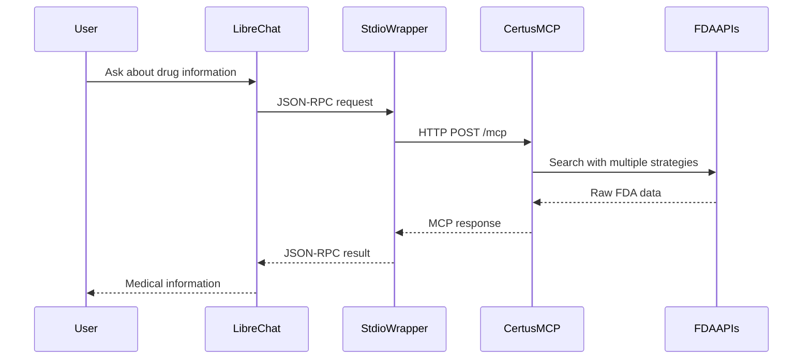

# Certus Drug Information MCP Server

A comprehensive Model Context Protocol (MCP) server providing real-time FDA drug information including shortages, recalls, labels, and market analysis. This server enables AI assistants and other MCP clients to access comprehensive pharmaceutical data using official FDA sources.

## Try the Live Chatbot

**Test the Certus system immediately:** https://certus-chat.opensource.mieweb.org

Access real-time FDA drug information through a ChatGPT-like interface. No setup required - just visit the link and start asking about drug shortages, recalls, and medication information.

> **Note:** If your search does not return results right away, try asking the chatbot to check the identifier type again. This is a known limitation of the current chatbot implementation, not a server issue.

## Key Features for Healthcare Professionals

### Real-Time Drug Shortage Information
- Search current FDA drug shortage database by generic or brand name
- Multiple search strategies to handle name variations and misspellings
- Raw FDA shortage data with minimal processing for accuracy
- Returns shortage reasons, resolution estimates, and affected product details when available

### Comprehensive FDA Drug Label Data
- Complete FDA-approved prescribing information and structured product labeling
- Generic and brand name cross-referencing through openFDA identifiers
- Dosage forms, strengths, routes of administration, and manufacturer information
- Active ingredients, indications, contraindications, warnings, and adverse reactions

### Drug Recall and Safety Information
- Real-time search of FDA enforcement database for drug recalls
- Recall classification (Class I, II, III), reason for recall, and affected lot information
- Product descriptions, distribution information, and recall initiation dates
- Raw FDA enforcement data for comprehensive recall analysis

### Historical Data Analysis
- Drug shortage pattern analysis using historical FDA shortage records
- Configurable time periods for trend analysis (1-60 months)
- Raw FDA data provided for custom analysis and interpretation
- Minimal processing preserves data integrity for accurate analysis

### Batch Processing Capabilities
- Simultaneous analysis of up to 25 medications in a single request
- Combined shortage, recall, and optional trend data for each drug
- Efficient formulary-wide assessment with single API call
- Structured results for each drug in the batch with error handling

### Clinical Information Integration
- Combined medication profiles with both FDA label and current shortage data
- Intelligent search across multiple FDA identifier types (generic name, brand name, openFDA fields)
- Cross-referenced data from FDA drug label and shortage databases
- Streamlined access to comprehensive FDA medication information

## How to Use the Chatbot

Visit https://certus-chat.opensource.mieweb.org and ask questions like:

**Drug Shortage Queries:**
- "Check current shortage status for insulin"
- "Search for metformin shortages"
- "Show shortage information for lisinopril"
- "Find shortage data for acetaminophen"

**Medication Label Information:**
- "Get FDA label information for metformin"
- "Show prescribing information for atorvastatin"
- "What are the approved uses for hydrochlorothiazide"
- "Get dosage forms available for ibuprofen"

**Drug Recall Searches:**
- "Search for recalls involving insulin products"
- "Check for any metformin recalls"
- "Find recent recalls for blood pressure medications"
- "Search recall database for acetaminophen"

**Complete Medication Profiles:**
- "Get complete medication profile for lisinopril"
- "Show combined label and shortage data for insulin"
- "Comprehensive information for metformin"

**Trend Analysis:**
- "Analyze shortage patterns for insulin over 12 months"
- "Show shortage trends for metformin in the past 6 months"
- "Historical shortage data for aspirin"

**Batch Analysis:**
- "Analyze these drugs for shortages: insulin, metformin, lisinopril"
- "Check shortage status for multiple diabetes medications"
- "Batch analysis of cardiovascular drugs with trend data"

## System Architecture

### Sequence Diagram



### Architecture Components

**Frontend Layer:**
- **LibreChat Interface** - ChatGPT-like web interface at `https://certus-chat.opensource.mieweb.org`
- **Claude Desktop Integration** - Direct MCP client access for AI assistants

**Integration Layer:**
- **Stdio Wrapper** - Bridges LibreChat's stdio transport to HTTP MCP protocol
- **Transport Compatibility** - Handles protocol translation between different MCP transports

**Backend Layer:**
- **Certus MCP Server** - Express.js server implementing MCP 2024-11-05 protocol
- **OpenFDA Client** - Intelligent API client with multiple search strategies
- **FDA Data Sources** - Drug Shortages, Labels, and Enforcement databases

**Data Flow:**
1. User queries are processed by LibreChat's AI engine
2. Tool calls are routed through the stdio wrapper to the MCP server
3. MCP server executes FDA API calls with intelligent fallback strategies
4. Raw FDA data is returned with minimal processing for accuracy
5. AI analyzes and presents medical information in user-friendly format

## Integration Options for Healthcare Systems

### Web-Based Chatbot Interface
Access the live chatbot at https://certus-chat.opensource.mieweb.org for immediate drug information queries without any setup required.

### Claude Desktop Integration
Add Certus tools directly to Claude Desktop for integrated AI assistant workflow with FDA drug data access.

### Custom MCP Client Development
Deploy the Certus server with any MCP-compatible client including:
- LibreChat for custom healthcare chatbots
- VS Code with MCP extensions for development environments
- Custom applications using MCP client libraries
- Third-party MCP-compatible tools and platforms

### Direct API Integration
Use REST API endpoints for custom healthcare applications:
- HTTP POST to `/mcp` endpoint for JSON-RPC tool calls
- Direct tool endpoints at `/tools/{tool_name}` for simple HTTP integration
- Health monitoring via `/health` endpoint
- Real-time data integration with existing systems

## Quick Start - Add to Claude Desktop

### Step 1: Add to Claude Desktop Config

Add this configuration to your Claude Desktop config file:

**macOS**: `~/Library/Application Support/Claude/claude_desktop_config.json`

**Windows**: `%APPDATA%\Claude\claude_desktop_config.json`

```json
{
  "mcpServers": {
    "Certus": {
      "command": "npx",
      "args": ["mcp-remote", "https://certus.opensource.mieweb.org/mcp"]
    }
  }
}
```

> **Note:** The `--allow-http` flag is only required if you are using an `http` URL. If your server URL starts with `https`, you do not need to include this flag.

#### Alternative Configuration (Backup Server)

If the main server is unavailable, use the Railway backup:

```json
{
  "mcpServers": {
    "Certus": {
      "command": "npx",
      "args": ["mcp-remote", "https://certus-server-production.up.railway.app/mcp"]
    }
  }
}
```

### Step 2: Restart Claude Desktop

Close and reopen Claude Desktop completely. The drug information tools should now be available.

### Step 3: Test the Integration

In Claude Desktop, try asking:

- "Check for insulin shortages in the FDA database"
- "Get complete medication profile for metformin"
- "Search for drug recalls involving acetaminophen"
- "Analyze shortage trends for lisinopril"
- "Show me FDA label information for atorvastatin"

## Available Tools

### Core Drug Information Tools

#### `search_drug_shortages`

Search the FDA drug shortages database using intelligent matching strategies.

**Parameters:**

- `drug_name` (string, required): Name of the drug (generic or brand name)
- `limit` (integer, optional): Maximum results to return (1-50, default: 10)

**Returns:** Raw FDA shortage data including shortage reasons, estimated resolution dates, and affected products.

#### `get_medication_profile`

Get comprehensive drug information combining FDA label data and current shortage status.

**Parameters:**

- `drug_identifier` (string, required): Drug name or identifier
- `identifier_type` (string, optional): Type of identifier (default: "openfda.generic_name")

**Returns:** Combined medication profile with both FDA label information and shortage data.

#### `search_drug_recalls`

Search the FDA enforcement database for drug recalls using multiple search strategies.

**Parameters:**

- `drug_name` (string, required): Drug name to search for recalls
- `limit` (integer, optional): Maximum results (1-50, default: 10)

**Returns:** Raw FDA enforcement data including recall classifications, reasons, and affected products.

#### `get_drug_label_info`

Retrieve FDA-approved drug label information and prescribing data.

**Parameters:**

- `drug_identifier` (string, required): Drug identifier
- `identifier_type` (string, optional): Type of identifier (default: "openfda.generic_name")

**Returns:** Complete FDA structured product labeling data.

### Advanced Analysis Tools

#### `analyze_drug_market_trends`

Analyze drug shortage patterns using historical FDA shortage data.

**Parameters:**

- `drug_name` (string, required): Drug name to analyze
- `months_back` (integer, optional): Analysis period in months (1-60, default: 12)

**Returns:** Raw FDA shortage records for the specified time period with minimal processing for custom trend analysis.

#### `batch_drug_analysis`

Simultaneously analyze multiple drugs for shortages, recalls, and optionally trends.

**Parameters:**

- `drug_list` (array, required): List of drug names (max 25 drugs)
- `include_trends` (boolean, optional): Include trend analysis (default: false)

**Returns:** Array of analysis results containing shortage data, recall data, and optionally trend data for each drug.

## Example Usage in Claude

```text
Search for current shortages of insulin and show me the raw FDA data

Get the complete FDA medication profile for metformin including label and shortage information

Search the FDA enforcement database for any recalls involving acetaminophen

Analyze shortage patterns for lisinopril using historical FDA data from the past 6 months

Perform batch analysis on these drugs: insulin, metformin, lisinopril, aspirin - include trend data

Get FDA label information for atorvastatin and check current shortage status
```

## Server Infrastructure

### Primary Deployment (Proxmox)

- **Main Server:** <https://certus.opensource.mieweb.org/mcp>
- **Status Check:** <https://certus.opensource.mieweb.org/health>
- **Host:** certus.opensource.mieweb.org
- **Service:** OpenFDA MCP Server
- **Tools Available:** 6 FDA drug information tools
- **Protocol:** HTTPS with CORS enabled

### Backup Deployment (Railway)

- **Backup Server:** <https://certus-server-production.up.railway.app/mcp>
- **Status Check:** <https://certus-server-production.up.railway.app/health>
- **Host:** Railway cloud platform

### API Health Status

Current FDA API endpoint availability:
- **Drug Labels Database:** Operational (HTTP 200)
- **Drug Shortages Database:** Operational (HTTP 404 responses indicate no current shortages, which is normal)
- **Drug Enforcement Database:** Operational (HTTP 200)
- **API Key Status:** Not configured (using public rate limits of 1,000 requests/day)

## Deploy Your Own Server

### Prerequisites

- Node.js 18+
- Railway account (free) or your own hosting
- Git

### Step 1: Clone and Setup

```bash
git clone https://github.com/zesty-genius128/Certus_server.git
cd Certus_server
npm install
```

### Step 2: Test Locally

```bash
# Start the server
npm start

# Test in another terminal
curl http://localhost:3000/health

# Test drug search
curl -X POST http://localhost:3000/mcp \
  -H "Content-Type: application/json" \
  -d '{
    "jsonrpc": "2.0",
    "id": 1,
    "method": "tools/call",
    "params": {
      "name": "search_drug_shortages",
      "arguments": {"drug_name": "insulin", "limit": 5}
    }
  }'
```

### Step 3: Deploy to Railway (Backup Option)

```bash
# Install Railway CLI
npm install -g @railway/cli

# Login to Railway
railway login

# Initialize project
railway init

# Deploy
railway up

# Get your URL
railway domain
```

### Step 4: Deploy to Your Own Infrastructure

For Proxmox or other self-hosted environments:

```bash
# Copy files to your server
scp -r . user@your-server:/path/to/certus-server/

# On your server
cd /path/to/certus-server
npm install
npm start

# For production with PM2
npm install -g pm2
pm2 start official-mcp-server.js --name certus-server
pm2 save
pm2 startup
```

### Step 5: Update Claude Config

Replace the URL in your Claude config with your deployed URL:

```json
{
  "mcpServers": {
    "Certus": {
      "command": "npx",
      "args": ["mcp-remote", "http://your-server.com:3000/mcp", "--allow-http"]
    }
  }
}
```

> **Note:** The `--allow-http` flag is only required if you are using an `http` URL. If your server URL starts with `https`, you do not need to include this flag.

## Configuration

### Environment Variables (Optional)

Create a `.env` file for enhanced API performance:

```bash
OPENFDA_API_KEY=your_fda_api_key_here
PORT=3000
```

Get a free FDA API key at: <https://open.fda.gov/apis/authentication/>

### Rate Limits

- Without API Key: 1,000 requests/day
- With API Key: 120,000 requests/day
- Intelligent Caching: Reduces API calls through smart result caching

## Testing and Debugging

### Test with MCP Inspector

```bash
# Test main server
npx @modelcontextprotocol/inspector https://certus.opensource.mieweb.org/mcp

# Test backup server
npx @modelcontextprotocol/inspector https://certus-server-production.up.railway.app/mcp

# Test local development
npx @modelcontextprotocol/inspector http://localhost:3000/mcp
```

### Health Check Commands

```bash
# Check main server status
curl https://certus.opensource.mieweb.org/health

# Check backup server status  
curl https://certus-server-production.up.railway.app/health

# Get available tools
curl https://certus.opensource.mieweb.org/tools
```

### Direct API Testing

```bash
# Test drug shortage search
curl -X POST https://certus.opensource.mieweb.org/mcp \
  -H "Content-Type: application/json" \
  -d '{
    "jsonrpc": "2.0",
    "id": 1,
    "method": "tools/call",
    "params": {
      "name": "search_drug_shortages", 
      "arguments": {"drug_name": "insulin", "limit": 3}
    }
  }'

# Test medication profile
curl -X POST https://certus.opensource.mieweb.org/mcp \
  -H "Content-Type: application/json" \
  -d '{
    "jsonrpc": "2.0",
    "id": 2,
    "method": "tools/call",
    "params": {
      "name": "get_medication_profile",
      "arguments": {"drug_identifier": "metformin"}
    }
  }'
```

## Project Structure

```text
Certus_server/
├── official-mcp-server.js    # Main MCP server implementation
├── openfda-client.js         # FDA API integration and data processing
├── stdio-wrapper.js          # Local development and testing support
├── package.json              # Dependencies and scripts
├── claude_desktop_config.json # Example Claude configuration
└── README.md                 # This documentation
```

## API Endpoints

| Endpoint   | Method | Description                              |
|------------|--------|------------------------------------------|
| `/health`  | GET    | Server health check and status           |
| `/mcp`     | POST   | MCP JSON-RPC endpoint for tool calls     |
| `/mcp`     | GET    | MCP SSE endpoint for real-time connections |
| `/tools`   | GET    | List all available tools and schemas     |
| `/`        | GET    | Server information and documentation     |

## Advanced Features

### Intelligent Drug Matching

- Multiple search strategies for drug name variations (generic, brand, openFDA fields)
- Automatic fallback search methods when initial queries return no results
- Handles common misspellings and name variations automatically
- Search strategy reporting shows which method successfully found results

### Comprehensive Data Integration

- **FDA Drug Shortages Database:** Real-time shortage information with reasons and estimated resolution
- **FDA Drug Labels Database:** Complete structured product labeling and prescribing information  
- **FDA Enforcement Database:** Drug recall and safety information with classification details

### Minimal Processing Architecture

- Raw FDA API responses preserved with minimal post-processing
- Original openFDA JSON structure maintained for accurate data representation
- Reduced data transformation overhead for better performance
- Enhanced for AI analysis with structured but unmodified FDA data

### Batch Processing

- Analyze up to 25 drugs simultaneously in a single request
- Combined shortage, recall, and optional trend analysis
- Efficient API usage with intelligent request batching
- Formulary-wide assessment capabilities

## Troubleshooting

### Common Issues

- **Tool not appearing in Claude:**
  - Restart Claude Desktop completely
  - Verify config file syntax is correct
  - Check that the server URL is accessible
- **Connection errors:**
  - Test server health: `curl https://certus.opensource.mieweb.org/health`
  - Try backup server if main is down
  - Check firewall/network connectivity
- **No results found:**
  - Try different drug name variations (generic vs brand)
  - Check spelling of drug names
  - Verify drug exists in FDA database
- **Rate limit issues:**
  - Add OpenFDA API key to environment variables
  - Reduce request frequency
  - Use batch operations for multiple drugs

### Debug Commands

```bash
# Check server status and capabilities
curl https://certus.opensource.mieweb.org/health

# View available tools
curl https://certus.opensource.mieweb.org/tools

# Test specific tool functionality
npm run test

# MCP protocol testing
npx @modelcontextprotocol/inspector https://certus.opensource.mieweb.org/mcp
```

## Use Cases

### Healthcare Applications

- Real-time drug shortage monitoring and information retrieval
- FDA drug label data integration for clinical systems
- Drug recall notification and safety monitoring
- Medication information lookup for clinical decision support

### AI Assistant Integration

- Enhanced medical chatbots with FDA drug data access
- Clinical workflow automation with drug information tools
- Healthcare assistant applications with real-time drug data
- Patient information systems with shortage and recall alerts

### Research and Analytics

- Pharmaceutical shortage pattern analysis using historical FDA data
- Drug recall trend research and safety monitoring
- Supply chain analysis using FDA shortage data
- Regulatory compliance monitoring with automated FDA data access

## Technical Specifications

- **Protocol:** Model Context Protocol (MCP) 2024-11-05
- **Data Sources:** FDA openFDA APIs (Drug Shortages, Labels, Enforcement)
- **Server:** OpenFDA MCP Server v2.0.0
- **Node.js:** 18+ required
- **Dependencies:** Express, CORS, Helmet, Compression, MCP SDK
- **Response Format:** JSON-RPC 2.0 with raw FDA data
- **Transport:** HTTP POST (JSON-RPC), SSE (Server-Sent Events), and stdio
- **Rate Limiting:** FDA API public limits (1,000 requests/day without API key)
- **Tools Available:** 6 FDA drug information tools
- **CORS:** Enabled for cross-origin requests

## Resources

- [Model Context Protocol Documentation](https://github.com/modelcontextprotocol/specification)
- [OpenFDA API Documentation](https://open.fda.gov/apis/)
- [Certus Server Repository](https://github.com/zesty-genius128/Certus_server)
- [Railway Deployment Guide](https://docs.railway.app/)

## License

MIT License

---

**Live Chatbot:** <https://certus-chat.opensource.mieweb.org>  
**Primary Server:** <https://certus.opensource.mieweb.org/mcp>  
**Backup Server:** <https://certus-server-production.up.railway.app/mcp>  
**Status:** Production Ready  
**Protocol:** MCP 2024-11-05  
**Data Sources:** FDA Drug Shortages, Labels, and Enforcement Databases