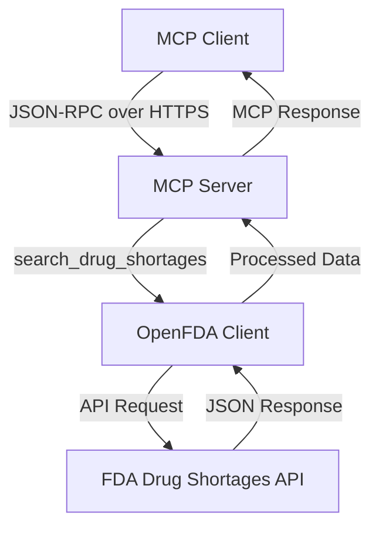

# Certus Remote Server

A production-ready Model Context Protocol (MCP) server that provides real-time FDA drug shortage information. This server enables AI assistants and other MCP clients to search for current drug shortages using official FDA data.

## Live Demo

MCP Endpoint: `https://certus-server-production.up.railway.app/mcp`

Test it instantly with MCP Inspector:

```bash
npx @modelcontextprotocol/inspector https://certus-server-production.up.railway.app/mcp
```

## Features

- Real FDA Data - Direct integration with openFDA Drug Shortages API
- Remote MCP Server - Accessible via HTTPS from anywhere
- MCP Protocol Compliant - Works with MCP Inspector and other MCP clients
- Smart Search - Multiple search strategies with relevance scoring
- Production Ready - Deployed on Railway with proper error handling
- Rich Data - Company info, shortage reasons, status, and timelines

## How It Works



### Architecture Components

1. MCP Server (`official-mcp-server.js`) - Handles MCP protocol and HTTP requests
2. OpenFDA Client (`openfda-client.js`) - Manages FDA API integration and data processing
3. Railway Deployment - Provides HTTPS endpoint and hosting
4. MCP Protocol - Enables AI assistant integration

## Available Tools

### `search_drug_shortages`

Search for current drug shortages using FDA data.

**Parameters:**

- `drug_name` (string, required): Name of the drug (generic or brand name)
- `limit` (integer, optional): Maximum results to return (1-50, default: 10)

**Example Response:**

```json
{
  "search_term": "insulin",
  "total_found": 3,
  "returned_count": 3,
  "shortages": [
    {
      "drug_name": {
        "generic": "insulin",
        "brand": "Humalog"
      },
      "shortage_details": {
        "status": "Current",
        "availability": "Limited",
        "reason": "Manufacturing delay"
      },
      "company": {
        "name": "Eli Lilly",
        "contact": "1-800-LillyRx"
      },
      "dates": {
        "initial_posting": "2024-01-15",
        "last_updated": "2024-02-01"
      }
    }
  ],
  "summary": {
    "current_shortages": 1,
    "recommendation": "1 current shortage(s) detected. Consider alternative sourcing."
  }
}
```

## Quick Start

### Option 1: Use the Live Server

```bash
# Test with MCP Inspector
npx @modelcontextprotocol/inspector https://certus-server-production.up.railway.app/mcp

# Direct API call
curl -X POST https://certus-server-production.up.railway.app/mcp \
  -H "Content-Type: application/json" \
  -d '{
    "jsonrpc": "2.0",
    "id": 1,
    "method": "tools/call",
    "params": {
      "name": "search_drug_shortages",
      "arguments": {"drug_name": "insulin", "limit": 5}
    }
  }'
```

### Option 2: Deploy Your Own

#### 1. Clone and Setup

```bash
git clone <your-repo-url>
cd drug-shortage-mcp-server
npm install
```

#### 2. Configure Environment

```bash
# Create .env file (optional but recommended)
echo "OPENFDA_API_KEY=your_fda_api_key_here" > .env
```

Get a free API key at: <https://open.fda.gov/apis/authentication/>

#### 3. Run Locally

```bash
# Start the server
npm start

# Or development mode with auto-reload
npm run dev

# Test locally
npx @modelcontextprotocol/inspector node stdio-wrapper.js
```

#### 4. Deploy to Railway

```bash
# Install Railway CLI
npm install -g @railway/cli

# Login and deploy
railway login
railway init
railway up
```

## API Endpoints

| Endpoint | Method | Description |
|----------|--------|-------------|
| `/health` | GET | Server health check |
| `/` | GET | Server info and documentation |
| `/mcp` | POST | MCP JSON-RPC endpoint |
| `/mcp` | GET | MCP SSE endpoint |
| `/tools` | GET | List available tools |
| `/tools/search_drug_shortages` | POST | Direct tool execution |

## Testing

### Test with MCP Inspector

```bash
# Remote server
npx @modelcontextprotocol/inspector https://certus-server-production.up.railway.app/mcp

# Local STDIO version
npm run inspect
```

### Test with curl

```bash
# Health check
curl https://certus-server-production.up.railway.app/health

# List tools
curl -X POST https://certus-server-production.up.railway.app/mcp \
  -H "Content-Type: application/json" \
  -d '{"jsonrpc":"2.0","id":1,"method":"tools/list","params":{}}'

# Search for drug shortages
curl -X POST https://certus-server-production.up.railway.app/mcp \
  -H "Content-Type: application/json" \
  -d '{
    "jsonrpc": "2.0",
    "id": 2,
    "method": "tools/call",
    "params": {
      "name": "search_drug_shortages",
      "arguments": {"drug_name": "morphine", "limit": 3}
    }
  }'
```

### Test Different Drugs

- `insulin` - Common medication
- `amoxicillin` - Antibiotic with historical shortages
- `morphine` - Controlled substance
- `acetaminophen` - OTC medication
- `ibuprofen` - Common pain reliever

## Integration Examples

### Python MCP Client

```python
from mcp import Client
from mcp.client.streamable_http import StreamableHTTPClientTransport

# Connect to the server
transport = StreamableHTTPClientTransport(
    "https://certus-server-production.up.railway.app/mcp"
)
client = Client("healthcare-app", "1.0.0")
await client.connect(transport)

# Search for drug shortages
result = await client.call_tool("search_drug_shortages", {
    "drug_name": "insulin",
    "limit": 10
})

print(f"Found {len(result.content)} shortage(s)")
```

### JavaScript/Node.js

```javascript
const response = await fetch('https://certus-server-production.up.railway.app/mcp', {
  method: 'POST',
  headers: { 'Content-Type': 'application/json' },
  body: JSON.stringify({
    jsonrpc: "2.0",
    id: 1,
    method: "tools/call",
    params: {
      name: "search_drug_shortages",
      arguments: { drug_name: "insulin", limit: 5 }
    }
  })
});

const data = await response.json();
console.log(data.result);
```

## Rate Limits

- Without API Key: 1,000 requests/day, 40/hour, 1/minute
- With API Key: 120,000 requests/day, 1,000/hour, 50/minute

## Configuration

### Environment Variables

- `PORT` - Server port (default: 3000, Railway uses 8080)
- `OPENFDA_API_KEY` - OpenFDA API key (optional but recommended)
- `NODE_ENV` - Environment (development/production)

### Search Strategies

The server uses multiple search strategies for better results:

1. Exact quoted search: `"insulin"`
2. Generic name search: `generic_name:"insulin"`
3. Proprietary name search: `proprietary_name:"insulin"`
4. OpenFDA generic search: `openfda.generic_name:"insulin"`
5. OpenFDA brand search: `openfda.brand_name:"insulin"`

## Troubleshooting

### Common Issues

1. No results found: Try different drug name variations
2. Rate limit exceeded: Get an FDA API key or wait
3. Connection timeout: Check server status at `/health`

### Debug Commands

```bash
# Check server status
curl https://certus-server-production.up.railway.app/health

# Test local server
npm start
curl http://localhost:3000/health

# View Railway logs
railway logs
```

## Resources

- [Model Context Protocol Documentation](https://github.com/modelcontextprotocol/specification)
- [OpenFDA API Documentation](https://open.fda.gov/apis/)
- [MCP Inspector](https://github.com/modelcontextprotocol/inspector)
- [Railway Deployment Guide](https://docs.railway.app/)

## Contributing

1. Fork the repository
2. Create a feature branch
3. Make your changes
4. Add tests if applicable
5. Submit a pull request

## License

MIT License - see LICENSE file for details.

## Use Cases

- Healthcare Applications - Check drug availability for patient care
- Pharmacy Management - Monitor supply chain disruptions
- Clinical Decision Support - Alert providers to shortage issues
- Research & Analytics - Study drug shortage patterns
- AI Assistants - Enable drug shortage queries in chat interfaces

---

Live Server: `https://certus-server-production.up.railway.app/mcp`  
Status: Production Ready  
Protocol: MCP 2024-11-05  
Data Source: FDA Drug Shortages Database
